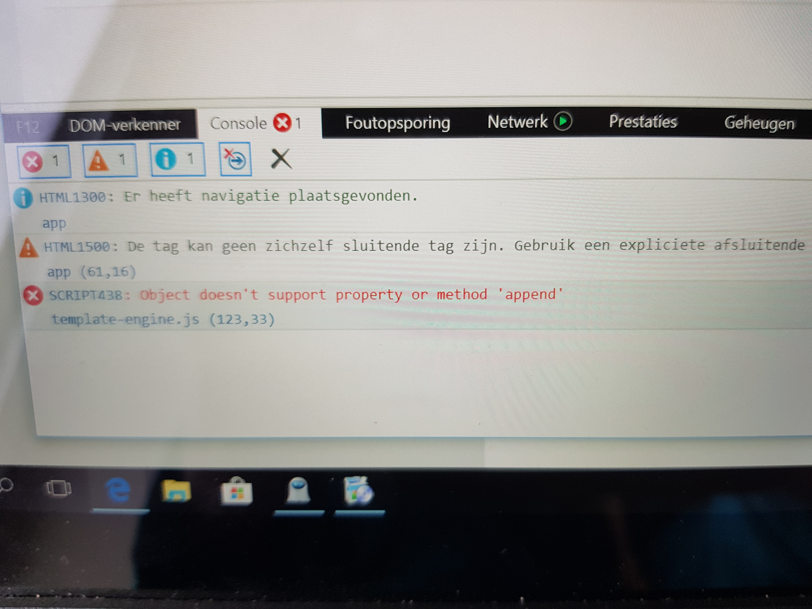

# Browser Technologies

[Opdracht 1.2](ASSIGNMENT.md)

In dit onderzoek naar te toegankelijk van de wafs website gekeken. Het onderzoek bestaat uit 8+ validatie checks. Sommige van deze checks zijn gerelateerd aan elkaar. Zo zou met JavaScript veel van deze punten verbeterd kunnen worden. Maar mocht JavaScript uitstaan, dan zal dit juist de andere punten verslechteren als deze door middel van JavaScript zijn verbeterd. Een goed voorbeeld hiervan is [webfontloader](https://github.com/typekit/webfontloader). Mocht JavaScript uitstaan dan worden er waarschijnlijk geen custom fonts gedownload, terwijl als dit via de HTML was gebeurd dan was dit geen enkel probleem geweest.

## Bevindingen
### Afbeeldingen
* Er zijn geen afbeelding gebruikt met uitzondering van svg. Deze bestanden worden niet geblokkeerd als afbeeldingen uitstaan.
### Custom fonts
* Google font wordt niet direct weergegeven. Verder geen problemen. Om dit goed te krijgen moet of het font lokaal gedownload worden of JavaScript gebruikt worden. Google fonts hebben standaard geen `font-display: swap;` eigenschap, dit is naar mijn mening een limitatie omdat je hiermee pas tekst weergeeft als het font is geladen. Wat Google fonts wel heel goed doet is om het kleinste bestandstype dat je computer ondersteund naar je op te sturen.

<details>
    <summary>Custom fonts disabled</summary>
    
</details>

### Javascript (volledig)
* Content laders blijft spinner, maar de content komt niet te voorschijn.
* Navigatie werkt niet.

<details>
    <summary>Blijft spinnen</summary>
    
</details>

Als de lader Blijft spinnen en er komt geen content, dan is dit natuurlijk geen goede feedback. De spinner zou aan het begin van de pagina niet zichtbaar moeten zijn. Maar wel op het moment dat de Javascript de data gaat ophalen.

### Kleur
* Grijstinten: De de geselecteerde sorteer knop die oranje is, krijgt nu de kleur grijs. Het is nu lastiger te zien welke geselecteerd is, maar de gebruiker zal niet nog een keer op deze knop gaan klikken, dat juist goed is. De geselecteerde knop is al `geselecteerd` en dus als gebruiker wil je natuurlijk niet hetzelfde content gaan weergeven dat je al ziet.

<details>
    <summary>Grayscale</summary>
    
</details>


### Breedband internet

<details>
    <summary>Status 1</summary>
    <p>Basis content wordt getoond, met uitzondering van:</p>
    <ul>
        <li>De `Sort by:` lijst, deze wordt door JavaScript toegevoegd.</li>
        <li>Pagina titel, deze is op een Google font aan het wachten.</li>
    </ul>
    

</details>
<details>
    <summary>Status 2</summary>
    <p>Vervolgens is de JavaScript en font geladen.</p>
    

</details>
<details>
    <summary>Status 3</summary>
    <p>De aanvraag naar de API is teruggestuurd.</p>
    
</details>

### Cookies
* (Geen cookies gebruikt.)

### localStorage
* Wanneer local storage is uitgezet, bevat de variable localStorage de waarden null. Het script werkt vervolgens niet meer.

<details>
    <summary>Error after localStorage disabled</summary>
    
</details>

Oplossing:
```JS
if (localStorage != undefined) {
    // localStorage exists
}
```

### Muis/Trackpad

```CSS
#sort-on-number > input:focus + label {
    outline: thick solid #3B99FC;
}
```
Een primaire focus status toegevoegd voor de sorteer knoppen.

```CSS
header [href="#main-nav"]:hover, header [href="#main-nav"]:focus {
    background-color: var(--main-color);
}
```
Een secondaire focus status toegevoegd voor een knop om de navigatie te openen.


```CSS
nav a:hover, nav a:focus {
    background-color: var(--main-color);
    color: white;
}
```
Een secondaire focus status toegevoegd voor de navigatie elementen.


### HTTP order
<details>
    <summary>Loading order Firefox</summary>
    
</details>
<details>
    <summary>Loading order Chrome</summary>
    
</details>

### Webpagetest
<details>
    <summary>Loading order Firefox</summary>
    
</details>


### Aria-labels
```HTML
<!-- Link naar hoofd navigatie -->
<a href="#main-nav" aria-label="To main navigation">Navigation</a>

<!-- Filter op asteroïde name -->
<label for="filter-input" aria-label="Search field for an asteroid.">Search:</label>

<!-- Sorteer op asteroïde content-->
<label for="sort-down" aria-label="Sort asteroid content down"></label>
<label for="sort-up" aria-label="Sort asteroid content up"></label>
```

Met het gebruik van een screenreader in de browser `Safari`, voeg ik aria labels toe om meer context aan de elementen toe te dienen.

### Apparaten

#### Moto G4 - Chrome
[Gedetailleerde informatie](https://www.webpagetest.org/result/180315_92_5ddc8b3b8bc4062373c74b4babbdf9a3/)

[Film strip](https://www.webpagetest.org/video/compare.php?tests=180315_92_5ddc8b3b8bc4062373c74b4babbdf9a3-r:1-c:0)

<details>
    <summary>Film strip</summary>
    
    <p>62% - 1.5s </p>
    
    <p>62% - 1.6s</p>
    
    <p>100% - 1.7s</p>
</details>

* Status 1: Laden van de content positie met tekst. (met uitzondering van de h1)
* Status 2: Laden van de svg afbeeldingen.
* Status 3: Laden van een Google font en JavaScript.


[Video](https://www.webpagetest.org/video/view.php?id=180315_DG_830cc767a5826f7919688cda71fca659.1.0&embed=1&width=408&height=592)

-----------------

#### iPhone 8 iOS 11
[Gedetailleerde informatie](https://www.webpagetest.org/result/180315_E7_5515b7f027756cbcca4e3606e60243b6/)

[Film strip](https://www.webpagetest.org/video/compare.php?tests=180315_E7_5515b7f027756cbcca4e3606e60243b6-r:1-c:0)

<details>
    <summary>Film strip</summary>
    
    <p>100% - 1.2s</p>
</details>

* Status: Laden van alles in 1 keer.


[Video](https://www.webpagetest.org/results/video/18/03/15/E7/5515b7f027756cbcca4e3606e60243b6.1.0/video.mp4)

-----------------

#### Galaxy_S5 - Chrome
[Gedetailleerde informatie](https://www.webpagetest.org/result/180315_DG_830cc767a5826f7919688cda71fca659/)

[Film strip](https://www.webpagetest.org/video/compare.php?tests=180315_DG_830cc767a5826f7919688cda71fca659-r:1-c:0)

<details style="display:flex">
    <summary>Film strip</summary>
    
    <p>58% - 1.2s</p>
    
    <p>58% - 1.4s</p>
    
    <p>100% - 1.5s</p>
</details>

* Status 1 en 2: Laden van de content positie, tekst en svg afbeeldingen.
* Status 3: Laden van een Google font en JavaScript.

[Video](https://www.webpagetest.org/results/video/18/03/15/DG/830cc767a5826f7919688cda71fca659.1.0/video.mp4)

-----------------

## Lab


Windows tablet error met internet explorer


Windows met nieuwste ondersteund Firefox en het werkt!


Smartphone laat het content zien. Maar het aanpassen met de filters en sorteren werkt nog niet.

-----------------

## Todo lijst
* Laden van fonts asynchroon, om zo meer controle te hebben over het laden. (met bv. [webfontloader](https://github.com/typekit/webfontloader))
* SVG afbeeldingen comprimeren om zo de knop stijling eerder weer te geven.
* Andere aria attributen uitproberen.
* Lab apparaten debuggen.

-----------------
