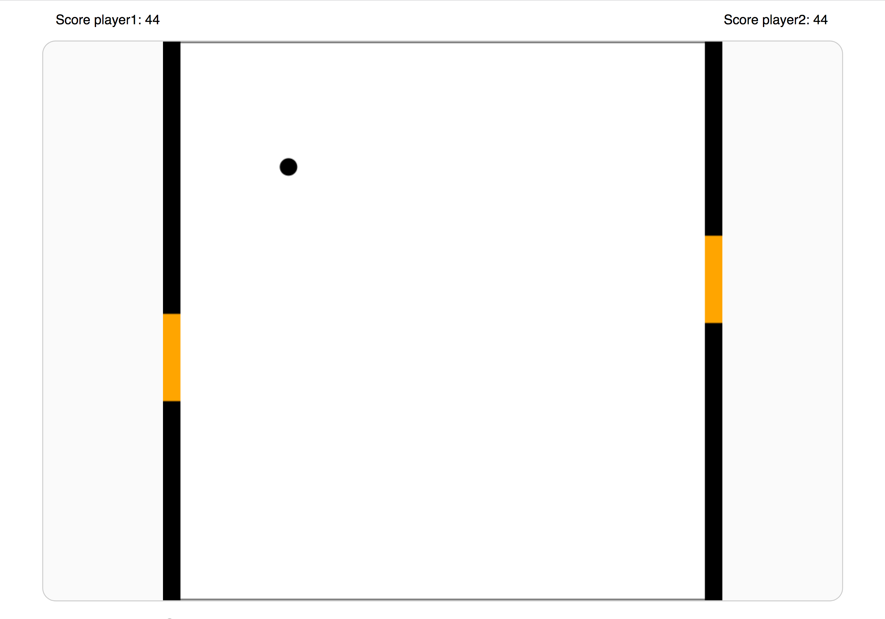

# Pong

[Opdracht 3](assignment.md)

Pong is een spel waarbij 1 of 2 spelers een balletje naar elkaars kant overschieten. Mocht de tegenstander het balletje niet raken met zijn bescherm balk, dan ontvang je score.


[Website](https://iiyama12.github.io/browser-technologies-1/opdracht3/)


## Controller X 4
* Knoppen (op het scherm)
* Toetsenbord
* Muis
* Touch


## HTML

### Game preview
```HTML
<body>
    <main>
        <div id="game-preview">
            
            <p>Waiting for Javascript, it is required for this game to work.</p>
        </div>
    </main>
</body>
```
Mocht Javascript uitstaan dan zal een preview worden weergegeven. Het spel is niet te spelen zonder JavaScript. JavaScript samen met canvas is daarom ook een deel van de bottomline. Ook aan de hand van het bestaan van addEventListener wordt er gecontrolleerd of de browser goed genoeg is om enkele van deze interacties uit te voeren.

<details>
    <summary>Preview</summary>
    
</details>


## CSS

### Unit support

```CSS
main {
    width: 960px;
    width: 60rem;

    max-width: 100%;
    max-width: 100vw;

    padding-bottom: 16px;
    padding-bottom: 1rem;

    padding-top: 48px;
    padding-top: 3rem;
}
```
Geen fallback, maar een `back-fall` of te well Cascade. Nu worden ontbekende CSS waardes (bv. rem) alleen toegepast als deze beschikbaar zijn. Pixels zijn vanuit oorsprong altijd beschikbaar.


### Wanneer Flexbox niet ondersteund wordt:
```CSS
#controls > div {
    width: 100%;
    display: flex;
}

#controls > div > section {
    width: 49.99%;
}
#controls > div > section:nth-of-type(2) {
    float: left;
}

@supports (display: flex) {
    #controls > div > section {
        flex-grow: 1;
        width: auto;
    }
}
```
Mocht display flex niet ondersteund worden, gebruik dan een float left met breedte 49.99%. Sommige browser geven problemen als je twee elementen naast elkaar zet met een breedte van 50%, er kan dan net een pixel te veel of te weinig worden gerekend en het content wordt dan niet naast elkaar gezet. Safari is hier erg goed in. Door aan beide kanten 0.01 pixel weg te halen los je dat probleem op. (Soms moet je meer weghalen)


## JS

### Append

<details>
    <summary>
        Weer in de fout gegaan met append.
    </summary>
    
    <p>De methode <i>append</i> lijkt heel erg op appendChild, maar deze methode is nog vrij nieuw voor deze browsers. Voor mij is het logisch om append ook te gebruiken voor maar 1 HTML node, ook al ondersteund hij het om er meer toe te voegen.</p>
</details>

---

### Canvas aanwezig?
```JS
var canvasElement = document.createElement("canvas");
if ("getContext" in canvasElement) {
    // ...
} else {
    gamePreview.getElementsByTagName("p")[0].textContent = "Canvas is unfortunately not supported by your browser, which is required for the game.";
}
```
Bij het gebruik van getContext methode wordt de [CanvasRenderingContext2D](https://html.spec.whatwg.org/multipage/canvas.html#canvasrenderingcontext2d) object teruggestuurd. Hierop kan je verschillende methodes toepassen om te tekenen binnen het canvas element.

(Tip van [James](https://github.com/Jamerrone) om te controleren op de getContext methode.)

[Canvas specificatie](https://html.spec.whatwg.org/multipage/canvas.html#the-canvas-element)

---

### Touch events

<details>
    <summary>
        Touch events niet ondersteund in IE.
    </summary>
    
    <p>Internet Explorer ondersteund de <i>touch(Move) events</i> niet. Maar wel de mousemove event. Hierdoor volgt hij de muis wel waardoor de twee balken gelijk blijven.</p>
</details>

[Video](https://vimeo.com/262180748)

<details>
    <summary>
        Pointer events toegevoegd voor IE.
    </summary>
    
    <p>Na het toevoegen van de <i>pointer events</i> ondersteund ook de tablet ook touch.</p>
</details>

[Video](https://vimeo.com/262180800)

---

### Configuratie controller
```JS
setControllerConfig: function (controller) {
    switch (controller) {
        case "keyPress":
            return true;
        case "mouseMove":
            return true;
        case "pointerMove":
            if (gameData.controller.functions.isControllerEnabled("mouseMove")) {
                gameData.controller.touchAndCursorElement.removeEventListener("mousemove",gameData.controller.functions.mouseMove, false);
            }
            gameData.controller.enabled.mouseMove = false;

            return true;
        case "touchMove":
            if (gameData.controller.functions.isControllerEnabled("mouseMove")) {
                gameData.controller.touchAndCursorElement.removeEventListener("mousemove",gameData.controller.functions.mouseMove, false);
            }
            if (gameData.controller.functions.isControllerEnabled("pointerMove")) {
                gameData.controller.touchAndCursorElement.removeEventListener("pointermove",gameData.controller.functions.pointerMove, false);
            }

            gameData.controller.enabled.mouseMove = false;
            gameData.controller.enabled.pointerMove = false;
            return true;
        default:
    }
    return false;
}
```
Met deze code wordt de juiste controller aangezet/gekozen. Dit is op basis van van controller gebruik. Mocht een gebruiker het (`keypress`) toetsenbord of (`mousemove`) muis gebruiken, dan heeft dit geen gevolgens. Maar bij de (`pointermove`) touch (IE variant) en (`touchmove`) touch (Apple variant), zal de (`mousemove`) worden uitgeschakeld. Daarnaast zal hij ook (`pointermove`) uitschakelen wanneer (`touchmove`) actief is.

---

### Overzicht prioriteit events en overschrijving
1. touchmove
2. pointermove
3. mousemove

(Hoger in de lijst is meer prioriteit)

Bij het activeren van een hogere prioriteit event, worden de onderliggende events uitgeschakeld.


<details>
    <summary>
        Eerste resultaat op oudere smartphones
    </summary>
    <ul>
        <li>
            
            <p>Op deze Samsung smartphone werkte de game in zijn geheel. De knoppen werkte helaas niet helemaal goed omdat deze veel te klein waren.</p>
        <li>
        <li>
            
            <p>Op deze smartphone was de schaal verhouding ook niet optimaal.</p>
        <li>
    </ul>
</details>

Oplossing
```HTML
<meta name="viewport" content="width=device-width, initial-scale=1">
```
De goede oude viewport tag helemaal vergeten!


## Design keuze
<details>
    <summary>
        Uitbreiding aanraak gebied
    </summary>
    
    <p>Aan de zijkanten van het spel is een extra aanraak oppervalte vrij gehouden voor touch apparaten. Hierdoor wordt je zicht op de schuivers belemmerd tijdens het spelen.</p>
</details>
